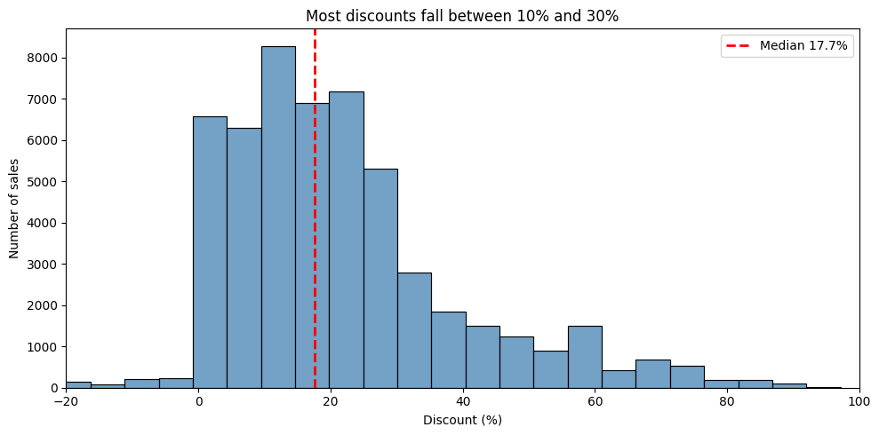
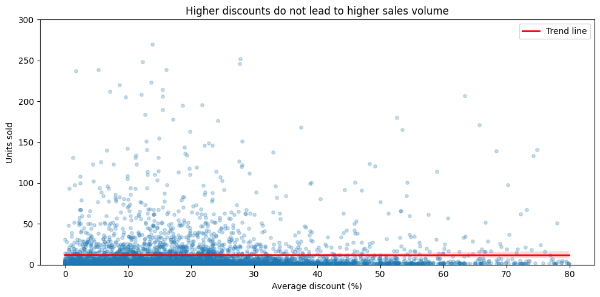
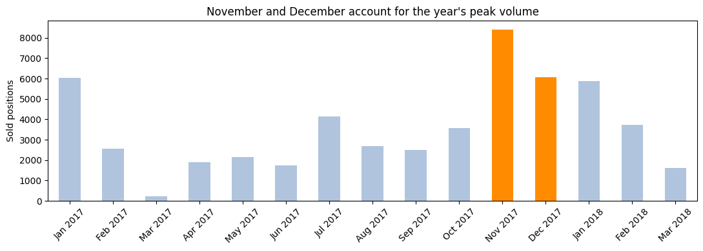

# Eniac Discount Strategy Analysis with Python & Pandas

## 🎯 Project Overview

Eniac, an e-commerce company specialising in premium tech products, is divided over its pricing strategy: the marketing team believes discounts drive growth, while the board suspects aggressive discounting is eroding revenue. This project analyses 14 months of transactional data to determine whether discounting is actually beneficial — and finds no measurable relationship between discount depth and sales volume.

## 📊 Dataset & Sources

**Source:** Internal Eniac data (provided by WBS Coding School)  
**Size:** 4 tables — 226,909 orders, 293,983 order lines, 19,326 products, 187 brands  
**Period:** January 2017 – 14 March 2018  
**Key features:** `unit_price` (price paid), `price` (list price), `product_quantity`, `created_date`, `state`, `sku`, `category`

**Data limitations:** The raw dataset was corrupted. Roughly two thirds of the product catalogue had to be excluded before analysis: malformed price formats, a `promo_price` column unusable in ~92% of rows, orphaned records between tables, and a multi-week data gap in February–March 2017. All findings rest on the remaining third.

## 🚀 Key Findings & Results

- **Discounting is the default, not a promotion:** 91.6% of all sold positions (48,734 of 53,231) were discounted, at a median of 17.7% and an average of 21.4%
- **No link between discount depth and sales volume:** products discounted at 5% and at 50% sell comparable quantities — the trend line across the full catalogue is flat
- **Seasonal peaks are demand-driven:** Black Friday (24 Nov 2017) produced 1,849 sold positions, roughly 20× a normal day, at a discount level in line with the annual average
- **Christmas peaks *after* the holiday:** the strongest December day is the 28th, with post-holiday trading outperforming the pre-Christmas period
- **The board's concern is not supported:** order volume and revenue move together throughout the period — there is no phase of rising orders alongside falling revenue

## 🛠️ Technologies Used

**Programming:** Python  
**Libraries:** pandas, seaborn, matplotlib  
**Techniques:** data cleaning with regular expressions, table joins, time series resampling, rule-based categorisation  
**Environment:** Google Colab

## 📁 Project Structure

notebooks/
eniac_discount_analysis.ipynb # full analysis

images # exported charts

presentation # final deck

README.md

## 📈 Visualisations

*Discounts cluster between 10% and 30%, with a median of 17.7% — a permanent price level rather than occasional promotions.*

*Each dot is one product. If discounting drove sales, the cloud would slope upward. It does not.*

*November and December carry the year, driven by Black Friday and post-Christmas demand.*

## 🔗 How to Use This Project

1. **Main analysis:** open [`eniac_discount_analysis.ipynb`](notebooks/eniac_discount_analysis.ipynb)
2. **Data:** loaded directly from Google Drive links inside the notebook — no manual download required
3. **Run the code:** open in Google Colab and run all cells top to bottom
4. **Dependencies:** standard data science stack, no special setup

## 🚀 Future Work

- **Controlled testing:** with 91.6% discount coverage there is no control group in the data. An A/B test on selected products would be needed to establish whether discounts pay for themselves
- **Price history:** adding validity dates to product prices would remove the negative-discount artefacts caused by comparing historical sales against a current price snapshot
- **Inventory data:** stock levels over time would clarify whether low sales reflect low demand or unavailability
- **Category refinement:** the rule-based categorisation covers the main product groups but leaves a residual category worth breaking down further

## 📧 Contact

**Email:** sharon.schwaab@outlook.de  

**LinkedIn:** [Sharon Schwaab](https://www.linkedin.com/in/sharon-schwaab/)

**GitHub:** [sharon-schwaab](https://github.com/sharon-schwaab)
